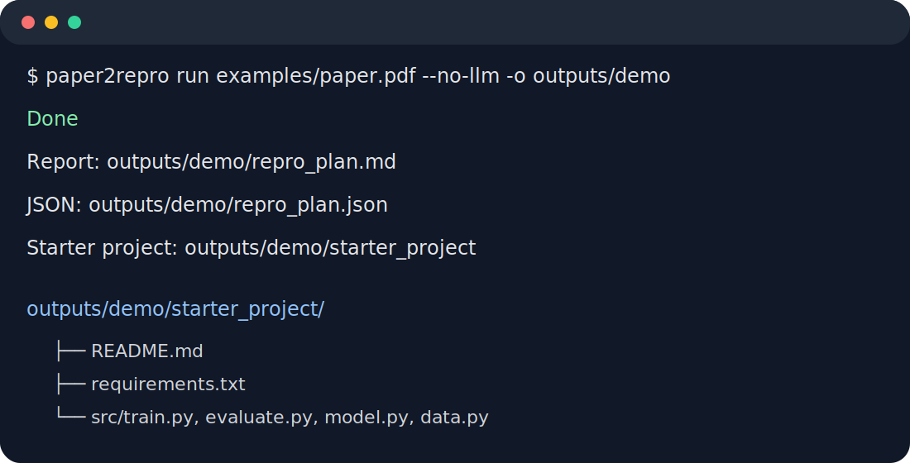

<p align="center">
  
</p>

# Paper2Repro Agent

[](https://github.com/YOUR_NAME/paper2repro-agent/actions/workflows/ci.yml)


**Paper2Repro Agent turns research paper PDFs into reproducible experiment plans, validation checklists, and starter code projects.**

It is designed for students and researchers who want to reduce the time between **“I found a paper”** and **“I know how to reproduce its main experiment.”**

<p align="center">
  
</p>

## Description

Paper2Repro Agent is a multi-agent research assistant for paper reproduction. Given a PDF, it parses the paper, extracts the research problem and core contribution, identifies datasets, baselines, metrics, hyperparameters, compute requirements, and implementation notes, then generates a practical reproduction package. The output includes a Markdown reproduction plan, a JSON file for downstream automation, a validation checklist, and a Python/PyTorch-style starter project with training and evaluation placeholders.

The project supports two modes: an offline heuristic mode that runs without an API key, and an LLM mode that uses structured JSON extraction for higher-quality summaries and experiment plans.

## Why this project exists

Reproducing papers is slow because key details are scattered across abstracts, method sections, experiment tables, appendices, and sometimes released code. Paper2Repro turns that reading process into a structured workflow:

1. **PDF Parser** extracts text and sections from the paper.
2. **Summary Agent** identifies the problem, core contribution, method, assumptions, and limitations.
3. **Experiment Agent** extracts datasets, baselines, metrics, hyperparameters, compute requirements, and implementation notes.
4. **Code Agent** generates a starter reproduction project with scripts such as `train.py`, `evaluate.py`, and `config.py`.
5. **Validation Agent** produces a checklist for verifying whether the reproduction is faithful.
6. **Reporter** writes both human-readable Markdown and machine-readable JSON.

## Features

- Works with or without an LLM API key.
- Uses OpenAI-compatible JSON extraction when `OPENAI_API_KEY` is available.
- Falls back to heuristic extraction when running offline.
- Produces both human-readable Markdown and machine-readable JSON.
- Generates a starter project that can be committed as the first step of a reproduction repo.
- Includes tests, CI, Pydantic models, project docs, and a clean Python package structure.
- Includes Chinese application-writing materials in `docs/application_zh.md`.

## Quick start

```bash
git clone https://github.com/YOUR_NAME/paper2repro-agent.git
cd paper2repro-agent
python -m venv .venv
source .venv/bin/activate
pip install -e .
```

On Windows PowerShell, activate the virtual environment with:

```powershell
.venv\Scripts\Activate.ps1
```

Run in offline heuristic mode:

```bash
paper2repro run path/to/paper.pdf --no-llm -o outputs/my_paper
```

Run with an LLM:

```bash
cp .env.example .env
# edit .env and set OPENAI_API_KEY
pip install -e '.[llm]'
paper2repro run path/to/paper.pdf -o outputs/my_paper
```

## Outputs

```text
outputs/my_paper/
├── repro_plan.md
├── repro_plan.json
└── starter_project/
    ├── README.md
    ├── requirements.txt
    └── src/
        ├── config.py
        ├── data.py
        ├── evaluate.py
        ├── model.py
        └── train.py
```

## Example application statement

> I built Paper2Repro Agent, an AI agent that converts research papers into reproducible experiment plans. It solves the pain point that reproducing papers often requires manually searching for model architecture, datasets, baselines, metrics, training settings, and validation steps. The system uses a multi-agent workflow: PDF Parser extracts the paper structure, Summary Agent identifies the contribution and method, Experiment Agent extracts datasets/baselines/metrics/hyperparameters, Code Agent generates a runnable Python/PyTorch project skeleton, and Validation Agent creates a reproducibility checklist. For a typical paper, the workflow costs about 50k–200k tokens depending on length and code-generation depth, and can reduce initial reproduction preparation from several hours to about 20 minutes.

More Chinese application material is available in [`docs/application_zh.md`](docs/application_zh.md).

## Architecture

See [`docs/architecture.md`](docs/architecture.md).

## Token plan

See [`docs/token_plan.md`](docs/token_plan.md).

## GitHub upload guide

See [`docs/github_upload_guide_zh.md`](docs/github_upload_guide_zh.md).

## Demo recording

After installing the package, place a PDF at `examples/demo/paper.pdf`, then run:

```bash
bash scripts/record_demo.sh examples/demo/paper.pdf
```

This prints the generated files and a preview of the reproduction plan. You can use it with screen recording tools to make a GIF for the README.

## Roadmap

- [ ] Add table extraction for experiment results.
- [ ] Add appendix-aware parsing.
- [ ] Add arXiv URL input.
- [ ] Add GitHub issue generation for reproduction tasks.
- [ ] Add physics-paper templates for computational physics and simulation papers.
- [ ] Add benchmark mode to compare extracted plans against human-written reproduction notes.

## Limitations

Paper2Repro is a planning assistant, not a guarantee of exact reproduction. Always verify generated plans against the original paper, appendix, official code, and dataset documentation.

## License

MIT
